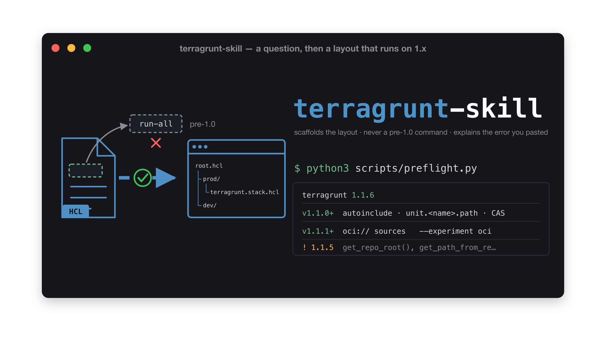

# terragrunt-skill

Generate, validate, review and debug Terragrunt **1.x** configurations across AWS, Azure
and GCP — from a reference set that states which Terragrunt release it tracks.

Part of [claude-skills](../README.md).

## What it does

It is a **router**, not a document to read front to back. Identify the task mode, read only
the listed reference, act:

| Task | Mode | Reads |
|---|---|---|
| Scaffold configs, envs, stacks | GENERATE | `architecture-patterns.md` + `templates/` |
| Validate / lint / CI | VALIDATE | `scripts/validate.sh`, `cli-reference.md` |
| Review or audit a repo | REVIEW | `best-practices.md` |
| An error was pasted | DIAGNOSE | grep `error-patterns.md` — 68 diagnosed errors |
| "What does X do" | LOOKUP | grep the matching reference |
| Multi-account, mocks, AVM, CFT | EXAMPLES | `advanced-examples.md` — 28 worked examples |
| OIDC, plan-then-apply pipelines | CI/CD | `cicd.md` |
| "Only run what changed", slow `run --all` | SCALE | `scale-and-performance.md` |
| Anything Azure backend or provider | *(any mode)* | **also** `azure-backend.md` |

References total ~7,700 lines and are written to be **grepped**, not read:
`grep '^## BLOCK: dependency' references/hcl-blocks.md`,
`grep -in 'state lock' references/error-patterns.md`. Reading whole files wastes context
and is not how the skill is meant to be used.

`templates/` carries working starting points for root, child, env, stack, catalog and
module configs, plus remote-state backends and provider `generate` blocks for all three
clouds — at essential and advanced tiers.

## The one hard policy

**Post-1.0 CLI only.** It will never generate or recommend `run-all`, `plan-all`,
`hclfmt`, `hclvalidate`, `graph-dependencies`, `validate-inputs`, `terragrunt-` prefixed
flags, the `skip` attribute, `retryable_errors`, or a bare `find_in_parent_folders()`
pointing at a root `terragrunt.hcl`. Where your code contains those, it flags them and
proposes the 1.x form.

## Version currency — read this before trusting a claim

The references track a **specific Terragrunt release**, and every reference file carries a
footer stating exactly what was verified and when. That is deliberate: Terragrunt's
*behaviour* and *experiments* move in patch releases, and semantic versioning describes
the API contract, not the documentation blast radius.

Current state: **this skill does not claim a current release.** Run `scripts/preflight.py` —
it reads `terragrunt --version` and tells you which gates your build satisfies and which
upgrade hazards apply to it. The references state when each feature landed, not what is
newest. The most recent lesson is worth
repeating — v1.1.2 was a patch that **reversed a two-year-old rule**. The
`azure-backend` experiment went from inert to functional, so "Terragrunt never bootstraps
Azure state" is now true only on the default path; on v1.1.2+ with
`--experiment azure-backend` it does bootstrap, converge, delete and migrate. The skill
now asks which version and which flags before advising, rather than asserting either
answer.

So: **when a Terragrunt release lands, re-read the release body in full** before trusting
these references. Not the summary — the Experiments section sits well below the fold, and
skimming it is exactly how the above was nearly missed.

## What it does NOT do

- **It does not run `apply`, or deploy anything.** It generates, validates, reviews and
  diagnoses. Running infrastructure changes is yours.
- **It does not invent identifiers.** Every template uses placeholders (`{{mustache}}` in
  backends and providers, `[BRACKET]` elsewhere) and all of them must be replaced before
  anything is presented. It will ask, or use obvious dummies labelled as such, rather than
  producing a plausible-looking account ID or secret.
- **It does not cover every experiment.** Eighteen were active as of v1.1.3 and these
  references cover only some. An unfamiliar `--experiment` value is *not* evidence that it
  is wrong — look it up rather than flagging it.
- **It does not assume OpenTofu or Terraform.** Terragrunt orchestrates either; the skill
  reads your repo for the signal (`.terraform-version`, `terraform_binary`, provider
  constraints, an `engine` block) rather than guessing.
- **It does not guess when the references fall short.** For anything newer or niche, it
  fetches [docs.terragrunt.com](https://docs.terragrunt.com), or queries
  [Context7](https://context7.com) through [`c7search`](https://github.com/kevin-burns/c7search)
  — a separate MIT CLI of mine, installable on its own.
- **It does not look up modules, resource types, or their inputs and outputs.** Terragrunt
  orchestrates modules; it does not tell you whether `terraform-aws-modules/vpc/aws` 5.8.1
  exists, which inputs it takes and which are required, what it returns, or what attributes an
  `azurerm_key_vault` actually has. Those answers live in the
  [Terraform Registry's JSON API](https://registry.terraform.io), and the
  [`terraform-registry`](https://github.com/kevin-burns/claude-skills/tree/main/terraform-registry)
  skill queries it directly — targeted lookup rather than scraping a page, cached as
  provenance-stamped snapshots so a repeat call costs nothing. Unlike `c7search` it has no
  standalone repo; it ships inside the claude-skills collection. Reach for it while writing an
  `inputs = {}` block or before pinning a version in a `source`, not after the apply fails.

## Requirements

The `terragrunt` and `terraform`/`tofu` CLIs for the VALIDATE mode; nothing for the
lookup, review and generate paths. `scripts/detect_custom_resources.py` is stdlib-only.
Where tooling is absent, the skill states plainly what it could not validate rather than
implying it did.

## Provenance

MIT, and **not wholly original** — five of the ten reference files began as curated data from
[omattsson/terragrunt-mcp-server](https://github.com/omattsson/terragrunt-mcp-server) (MIT),
restructured for grep-based lookup and since re-checked against docs.terragrunt.com. That
repository's last commit predates Terragrunt v1.0.0 by five weeks, so the re-checks are what
make the content current, not the source. Layout and scaffolding guidance describes Gruntwork's
published example repositories and [boilerplate](https://github.com/gruntwork-io/boilerplate)
(MPL-2.0), the engine behind `scaffold` and `catalog`. Full detail, including per-file scope,
is in `SKILL.md`. **Terragrunt** is © Gruntwork, Inc. (MIT); this skill is not affiliated with
or endorsed by Gruntwork.
