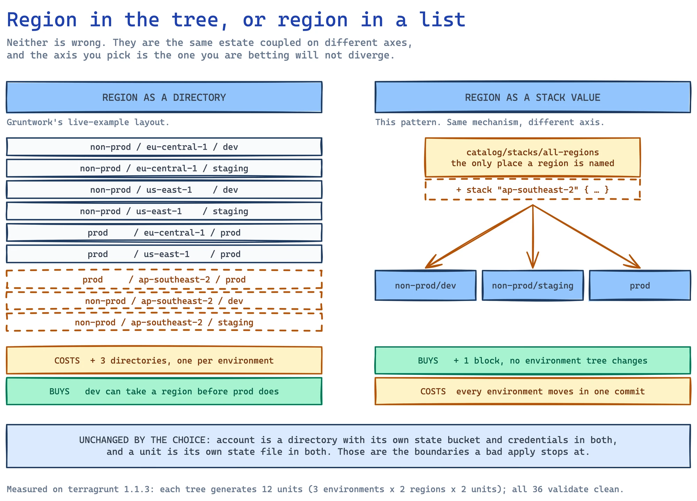

# Terragrunt Architecture Patterns (1.0.x)

> Scope: Terragrunt 1.0.x. Terminology follows Gruntwork's canonical docs: a **unit** is a
> directory with a `terragrunt.hcl` deploying one OpenTofu/Terraform module; a **stack** is a
> group of units, either **implicit** (a directory tree of units) or **explicit**
> (defined in a `terragrunt.stack.hcl`).
> Docs: https://docs.terragrunt.com/getting-started/terminology/ ·
> https://docs.terragrunt.com/features/units/ · https://docs.terragrunt.com/features/stacks/

Every generated layout MUST be referenceable against a documented Gruntwork pattern. If a user
asks for something not covered here, look it up (C7 search / docs.terragrunt.com) before
inventing structure.

## The one inviolable rule: include hierarchy is physical

`find_in_parent_folders("X")` and `read_terragrunt_config()` resolve against the real directory
tree at parse time. Before writing any file, verify every referenced path exists *from that
file's location*. The most common generation bug is a root config reading an environment file
that only exists below it.

- Root config (`root.hcl`) in a multi-environment tree is **environment-agnostic**:
  - MUST NOT call `read_terragrunt_config(find_in_parent_folders("env.hcl"))` — no `env.hcl`
    exists at or above root level.
  - MUST NOT reference locals sourced from `env.hcl`.
  - MAY use static values, `get_env()`, and `path_relative_to_include()` (resolved per-unit,
    so it is safe in root — this is the standard mechanism for unique state keys).
- Units read environment config themselves:
  `read_terragrunt_config(find_in_parent_folders("env.hcl"))`.
- Root file is named `root.hcl`, included with `find_in_parent_folders("root.hcl")`.
  A bare, argument-less `find_in_parent_folders()` call targeting a root `terragrunt.hcl` is a pre-1.0 idiom —
  do not generate it.
  Docs: https://docs.terragrunt.com/migrate/migrating-from-root-terragrunt-hcl/


## Path anchoring: marker files over git

Absolute-path building should anchor to the **config hierarchy**, not git:

- **Prefer** `dirname(find_in_parent_folders("root.hcl"))` — resolves relative to the
  root marker file, which always ships with the configs.
- In unit configs that `include "root"`, `get_parent_terragrunt_dir("root")` is an
  equivalent, cleaner form (directory containing the named included config).
- **`get_repo_root()` is git-anchored** (walks up to `.git`). It mis-resolves or fails when:
  the working tree is an exported artifact with no `.git`; CI checks out only the
  infrastructure subtree; or the git root sits above the infrastructure root (monorepos).
  Only generate it when the user confirms the git root IS the infrastructure root and
  configs always run from a real clone.
Docs: https://docs.terragrunt.com/reference/hcl/functions/

## PATTERN: multi-environment, environment-agnostic root (default)

Use when managing dev/staging/prod (or similar) with shared root configuration. This is the
default choice — when in doubt, generate this.

```
infrastructure/
├── root.hcl              # environment-AGNOSTIC (remote_state, provider generate, common)
├── dev/
│   ├── env.hcl           # locals: environment, region, cidrs, sizing
│   ├── vpc/terragrunt.hcl
│   └── rds/terragrunt.hcl
└── prod/
    ├── env.hcl
    ├── vpc/terragrunt.hcl
    └── rds/terragrunt.hcl
```

Unit config shape:

```hcl
# dev/vpc/terragrunt.hcl
include "root" {
  path = find_in_parent_folders("root.hcl")
}

locals {
  env = read_terragrunt_config(find_in_parent_folders("env.hcl"))
}

terraform {
  source = "tfr:///terraform-aws-modules/vpc/aws?version=5.8.1"
}

inputs = {
  name = "${local.env.locals.environment}-vpc"
  cidr = local.env.locals.vpc_cidr
}
```

Docs: https://docs.terragrunt.com/features/units/includes/

## PATTERN: environment-aware root (single environment or path-derived env)

Use for a single environment, or when the root derives the environment from context rather
than per-env files.

```
infrastructure/
├── root.hcl              # MAY be environment-aware here
├── account.hcl           # optional account-level locals
├── region.hcl            # optional region-level locals
└── vpc/terragrunt.hcl
```

```hcl
# root.hcl — environment detection
locals {
  # From the unit's path relative to root, e.g. "prod/vpc" -> "prod"
  path_parts  = split("/", path_relative_to_include())
  environment = local.path_parts[0]
  # OR from the runtime environment:
  # environment = get_env("TG_ENVIRONMENT", "dev")
}
```

## PATTERN: centralized environment definitions (_env directory)

Use when environment variable sets are shared/centralized and per-env `env.hcl` files
re-export them.

```
infrastructure/
├── root.hcl              # environment-AGNOSTIC
├── _env/
│   ├── dev.hcl
│   └── prod.hcl
├── dev/
│   ├── env.hcl           # reads <infra root>/_env/dev.hcl, re-exports locals
│   └── vpc/terragrunt.hcl
└── prod/
    ├── env.hcl
    └── vpc/terragrunt.hcl
```

```hcl
# prod/env.hcl
locals {
  # Anchor to the config hierarchy (root.hcl marker), not git — survives CI checkouts
  infra_root  = dirname(find_in_parent_folders("root.hcl"))
  env_vars    = read_terragrunt_config("${local.infra_root}/_env/prod.hcl")
  environment = local.env_vars.locals.environment
  aws_region  = local.env_vars.locals.aws_region
}
```

## PATTERN: explicit stacks (terragrunt.stack.hcl)

Use when the same group of units is instantiated repeatedly (per env, per region, per tenant).
An explicit stack defines `unit` blocks (and optionally nested `stack` blocks); `terragrunt
stack generate` materializes them under `.terragrunt-stack/`, and `terragrunt stack run`
executes across them.

```hcl
# terragrunt.stack.hcl
locals {
  infra_root = dirname(find_in_parent_folders("root.hcl"))
}

unit "vpc" {
  source = "${local.infra_root}/catalog/units/vpc"
  path   = "vpc"
}

unit "rds" {
  source = "${local.infra_root}/catalog/units/rds"
  path   = "rds"
  values = {                       # passed to the generated unit
    instance_class = "db.t3.medium"
  }
}
```

**How it works.** `terragrunt stack generate` reads the `unit`/`stack` blocks and
materializes `.terragrunt-stack/<path>/` for each — a `unit` produces a `terragrunt.hcl`;
a nested `stack` block produces another `terragrunt.stack.hcl` (then itself expanded).
`terragrunt stack run <cmd>` regenerates and runs across the stack in dependency order.

- **`source`** uses the same forms as the `terraform` block: local paths, `git::…?ref=…`,
  `tfr://` registry, and OCI image references.
- **`values`** in a block is written to a `terragrunt.values.hcl` beside the generated
  unit's `terragrunt.hcl`; the unit reads them as `values.<key>` (e.g.
  `values.instance_class`). A `terragrunt.values.hcl` shipped in the source acts as
  defaults and is replaced when the block sets `values`.
- **`.terragrunt-stack/` is generated output:** gitignore it (along with
  `.terragrunt-local-state`); `terragrunt stack clean` removes it. Regeneration does **not**
  purge stale files by default — use `stack generate --source-update` or `stack clean`
  first when sources change.
- Prefer implicit stacks (plain directory trees) until duplication across envs/regions makes
  explicit stacks pay for themselves — this matches Gruntwork's guidance progression.
- Reusable unit definitions conventionally live under `catalog/units/<name>` (see
  templates/catalog and templates/stack).
- **Version note (v1.1.0 GA, 2026-07-01):** the schema common to all 1.x is `source`, `path`,
  `values`, `no_dot_terragrunt_stack`, `no_validation`. The stack-dependency additions —
  `autoinclude` (with `unit.<name>.path` / `stack.<name>.path` references), `update_source_with_cas`,
  `mutable`, and a `dependency` targeting a stack directory (declared inside an `autoinclude`
  block) — graduated from the `stack-dependencies` / `cas` experiments to **GA in v1.1.0** and
  are enabled by default. They require **v1.1.0+**; don't emit them for repos pinned to ≤1.0.x.
  `include` blocks in stack files: the v1.1.0 changelog states they now work, but the Stacks
  "Limitations" doc page still lists them as unsupported — treat as a docs lag and verify
  against the pinned version before relying on them. See references/hcl-blocks.md
  `## BLOCK: unit` and `## BLOCK: autoinclude`.

Docs: https://docs.terragrunt.com/features/stacks/explicit/ ·
https://docs.terragrunt.com/reference/cli/commands/stack/generate/

## PATTERN: catalog repository (the other repo in the two-repo model)

Everything above describes the **live** repo — the tree you actually deploy. A catalog repo is
the other half: it holds the reusable pieces the live tree scaffolds *from*, and it is what
`terragrunt catalog` browses and `terragrunt scaffold` consumes.

Gruntwork publishes the reference layout as
[terragrunt-infrastructure-catalog-example](https://github.com/gruntwork-io/terragrunt-infrastructure-catalog-example)
(MPL-2.0). Its actual shape, read from the repo on 2026-08-19:

```
infrastructure-catalog/
├── modules/          # the OpenTofu/Terraform modules themselves
│   ├── s3-bucket/
│   ├── dynamodb-table/
│   ├── lambda-service/
│   └── ...
├── units/            # a terragrunt.hcl per module: the wrapper a live tree includes
│   ├── lambda-stateful-service/
│   ├── mysql/
│   └── ...
├── stacks/           # terragrunt.stack.hcl: units composed into a deployable set
│   └── ec2-asg-stateful-service/
├── examples/
├── docs/
└── test/
```

**The three directories are three different things and the distinction is the whole point.**
`modules/` is Terraform. `units/` wraps one module with Terragrunt config. `stacks/` composes
units. A live repo then references a stack rather than restating its parts — which is why
adding a unit to a stack changes every environment that consumes it, and why a live tree stays
small.

Note it is `units/` and `stacks/` as siblings of `modules/`, **not** nested under it. Since
v1.1.0 `catalog` discovers components anywhere in the repo rather than only under `modules/`,
so the layout is a convention rather than a constraint — but it is the convention `catalog`
labels correctly, and each component's kind (`template`, `stack`, `unit`, `module`) shows in
the TUI.

Give any module a `.boilerplate/boilerplate.yml` to control what `scaffold` prompts for when
someone pulls it into a live tree. See `## COMMAND: scaffold` in `cli-reference.md`.

**The live counterpart**, from
[terragrunt-infrastructure-live-example](https://github.com/gruntwork-io/terragrunt-infrastructure-live-example)
(Apache-2.0), read on 2026-08-19, is the account → region → environment tree the patterns above
describe, with a root `_envcommon/` holding the shared per-unit config:

```
infrastructure-live/
├── _envcommon/
├── non-prod/
│   ├── account.hcl
│   └── us-east-1/
│       ├── qa/
│       └── stage/
└── prod/
    ├── account.hcl
    └── us-east-1/
        └── prod/
```

That `_envcommon/` is the centralised-environment-definitions pattern above, under Gruntwork's
own name for it.

## PATTERN: two accounts, many regions (accounts isolate state, one file holds the region list)



Use when the estate spans **more than one account** and **more than one region**, and the
region list is expected to grow.

**First, what Gruntwork actually publishes, because this pattern departs from it and should say
so.** Their canonical live repo is `<account>/<region>/<env>/<unit>` with `account.hcl`,
`region.hcl` and `env.hcl` at their respective levels and a shared `_envcommon/`. The getting-
started tutorial in the docs builds up to the same shape — a `us-east-1/region.hcl` read from
`root.hcl`. **That is the default, it is not a mistake, and any layout guide you find will
show it.** Read on 2026-08-20 from
[terragrunt-infrastructure-live-example](https://github.com/gruntwork-io/terragrunt-infrastructure-live-example).

**The reason to reach for something else is narrow and worth stating precisely.** That example
contains exactly **one** region, `us-east-1`, in both accounts. The layout everyone copies has
never been exercised against the case this pattern is for. Put the region in the tree and
adding a third one means a new directory in every environment — six become nine here — and each
is a copy of a tree that already existed.

**The mechanism below is still Gruntwork's**, which matters because this skill does not invent
layouts. Their catalog example's `stacks/multi-env-stateful-asg-services/terragrunt.stack.hcl`
lists sibling `stack` blocks pointing at one shared composition and varying only `values` — it
fans **environments** from a single file. This pattern points the same mechanism at the region
axis instead.

- **Account is a state boundary.** One state bucket per account; `account.hcl` is the single
  file per account that names it. `root.hcl` reads `account.hcl` and nothing else, which is
  what keeps it environment-agnostic (see the inviolable rule at the top of this file).
- **Region is a multiplicity, not a directory.** It belongs in `values` on a `stack` block.
  One stack file lists the active regions and every environment instantiates that same file,
  so adding a region is one block in one file and no environment's tree changes.

```
live/
├── root.hcl                                    # env-agnostic; reads account.hcl only
├── non-prod/
│   ├── account.hcl                             # account id + state bucket for this account
│   ├── dev/       {env.hcl, terragrunt.stack.hcl}
│   └── staging/   {env.hcl, terragrunt.stack.hcl}
└── prod/
    ├── account.hcl
    └── env.hcl, terragrunt.stack.hcl
catalog/                                        # SIBLING of live/, not inside it — trap 3
├── stacks/all-regions/terragrunt.stack.hcl     # THE region list, in one place
├── stacks/region-stack/terragrunt.stack.hcl    # what exists once per region
└── units/{vpc,s3-bucket}/terragrunt.hcl        # parameterised by values.*
```

Each environment's stack file instantiates the region list, passing only what varies by
environment:

```hcl
# live/prod/terragrunt.stack.hcl
locals {
  infra_root = dirname(find_in_parent_folders("root.hcl"))
  env        = read_terragrunt_config("env.hcl")   # NOT find_in_parent_folders — trap 1
}

stack "regions" {
  source = "${local.infra_root}/../catalog/stacks/all-regions"
  path   = "regions"
  values = { environment = local.env.locals.environment }
}
```

The region list forwards `environment` down and adds the one thing it owns:

```hcl
# catalog/stacks/all-regions/terragrunt.stack.hcl — the only place regions are named
stack "eu-central-1" {
  source                  = "${local.infra_root}/../catalog/stacks/region-stack"
  path                    = "eu-central-1"
  no_dot_terragrunt_stack = true                    # keeps state keys as regions/<region>/<unit>
  values = { aws_region = "eu-central-1", environment = values.environment }
}
```

### Three traps, each one measured on a generated tree

**1. `find_in_parent_folders` does not look in the current folder.** `env.hcl` sits *beside*
the environment's `terragrunt.stack.hcl`, not above it, so
`read_terragrunt_config(find_in_parent_folders("env.hcl"))` walks past it to the repo root and
fails the whole tree. One of the three runs wrote exactly this, and nothing before
`stack generate` caught it — the file parses, formats clean, and the include graph looks
plausible:

```
Call to function "find_in_parent_folders" failed: ParentFileNotFoundError: Could not find a
env.hcl in any of the parent folders of .../dev/terragrunt.stack.hcl. Cause: Traversed all the
way to the root..
```

Use `read_terragrunt_config("env.hcl")`. A relative path resolves against the config file's own
directory, not the shell's, so it holds whether the command is run from that environment or
from the repo root — both were run. `read_terragrunt_config("${get_terragrunt_dir()}/env.hcl")`
is equivalent and more explicit; pick one. `account.hcl` is the contrast that makes the rule
legible: it genuinely *is* in a parent folder, so `find_in_parent_folders` is right there and
wrong one directory down.

Filed as `## ERROR: ParentFileNotFoundError on a file that sits beside the config` in
`references/error-patterns.md`. Worth knowing where the wrong form comes from: the
`find_in_parent_folders` entry in
`functions.md` uses `env.hcl` as its own example filename, and the `read_terragrunt_config`
entry pairs itself with `find_in_parent_folders` in its first example. Copying the house style
of the surrounding examples is exactly how this lands in a stack file where it cannot work.

**2. `hcl validate` cannot judge a catalog unit in place.** Catalog units reference `values.*`,
which is bound only when `terragrunt stack generate` materialises them. Validating the raw tree
reports every one of those as `Error: Unknown variable` — noise, not defects. Validate the
*generated* units: `terragrunt stack generate`, then `hcl validate`. On the tree above that is
3 environments × 2 regions × 2 units = 12 generated units, all clean, while the same command
over the un-materialised `catalog/` reports 24 errors that mean nothing.

**3. A `catalog/` inside the live tree breaks estate-wide commands.** `stack generate` from the
repo root discovers and parses the catalog's own stack files, hits the unbound `values.*` from
trap 2, and fails before generating anything. `--filter` does not exclude them. Either run
`stack generate` per environment, or keep the catalog outside the live tree — a sibling
directory is enough, and the two-repo model above does it by construction. Measured on the tree
above: catalog inside → root-level generate fails; catalog moved to a sibling → 0 errors, all
12 units generated by one command, `hcl validate` over the live tree clean.

> **Provenance, and why this is written down at all.** Asked conversationally for a
> two-account two-region AWS repo — with "adding a region later shouldn't mean copy-pasting a
> directory tree" stated in the request — this skill was run three times. **Two of the three
> put the region in the directory tree** (`account/region/env/`), which is the layout Gruntwork's
> live-example repo uses and which the catalog pattern above shows. It is a good default and it
> does not satisfy that request: a third region means three more directories per environment.
> One run produced the layout above. This section exists so the region-as-`values` option is
> reachable rather than a one-in-three outcome.
>
> All three trees were then run through `terragrunt hcl fmt`, `hcl validate` and
> `stack generate` on **terragrunt 1.1.3**. Every one generated 12 units (3 environments × 2
> regions × 2 units) that validate clean; one needed the one-line fix in trap 1 first, and one
> fails `hcl fmt --check` on comment alignment. The three traps below are what broke.

Docs: https://docs.terragrunt.com/features/stacks/explicit/ ·
https://docs.terragrunt.com/reference/cli/commands/stack/generate/

## PATTERN: migrate an existing tree to explicit stacks

Use when an existing implicit layout (directory tree of `terragrunt.hcl` units, often with an
`_envcommon`/`_env` pattern) should become explicit `terragrunt.stack.hcl` stacks. Migration
### Mixing implicit and explicit stacks in one repo

**You can, and Terragrunt's own guidance expects you to.** A classic directory tree of units
(an *implicit* stack) and a `terragrunt.stack.hcl` (an *explicit* stack) coexist in the same
repository. docs.terragrunt.com presents implicit stacks as the place to start — small unit
counts, teams new to Terragrunt — and explicit stacks as what you introduce for reusable
patterns as the estate grows. The classic layout is a current, supported choice, not a
deprecated one.

**The one hard rule: never both in the same directory.** From the v1.0.0 release notes
(2026-03-30):

> "Previously, Terragrunt would silently engage in undefined behavior when both a
> `terragrunt.hcl` and `terragrunt.stack.hcl` file existed in the same directory. With this
> release, Terragrunt will start to throw warnings and prevent such usage. Users will have to
> ensure that only one of a unit (`terragrunt.hcl`) or stack configuration
> (`terragrunt.stack.hcl`) exist in a unit or stack directory, respectively."

So a repo mixing the two is normal; a *directory* mixing the two is an error on v1.0.0+ and was
**silent undefined behaviour before it**. If you are migrating a tree that was laid out under
pre-1.0 Terragrunt, that directory is a thing to go and look for — it may have been quietly
wrong for months without ever failing a run.

is **optional and incremental** — if the current layout works, adopt stacks only for *new*
infrastructure. The hazard is **state**: done wrong, every unit's state key changes and
Terragrunt plans to destroy-and-recreate live infrastructure.

**The state-key safety rule.** Your root `remote_state` `key` almost certainly uses
`path_relative_to_include()`. Set **`no_dot_terragrunt_stack = true`** on each migrated
`unit`/`stack` block so generation lands the unit in the *same directory* it lived in before,
keeping `path_relative_to_include()` — and therefore the state key — identical. Omit it and
the unit generates under `.terragrunt-stack/…`, the key changes, and state is orphaned.

Runbook (reversible — originals stay until verified):
1. **Pin a Terragrunt version** that supports `terragrunt.stack.hcl`, and add `.terragrunt-stack`
   (plus `.terragrunt-local-state`) to `.gitignore`.
2. **Author `terragrunt.stack.hcl`** describing the existing units, each with `source`
   (pinned `?ref=`), `path`, and **`no_dot_terragrunt_stack = true`**; move per-env values
   from `_envcommon` into each block's `values = { … }`.
3. **Generate:** `terragrunt stack generate` — materializes the units in place.
4. **PARITY GATE — prove state is preserved before deleting anything.** For a representative
   migrated unit, run `terragrunt plan` (or `run --all plan`) and confirm it reports
   **no changes** — no create/destroy/replace, no "moved"/state-key churn. A clean plan is the
   authoritative proof that `path_relative_to_include()` resolved to the *same* key and the
   existing state is intact. If plan wants to create everything, the key changed — **stop**,
   recheck `no_dot_terragrunt_stack`, and do not delete the originals. (Optional extra check:
   `terragrunt render --format json` prints the resolved config; inspect the backend section
   if your render output includes it. The plan-no-change result is the gate that matters.)
5. **Only then** remove the original unit configs (they regenerate on demand via
   `stack generate`) and the `_envcommon` directory; commit `terragrunt.stack.hcl`.
6. **CI/CD:** either commit the generated `.terragrunt-stack/` dirs (simplest), or run
   `terragrunt stack generate` then `terragrunt run --all plan/apply --non-interactive` in the
   pipeline.

> The migrate docs describe the mechanics and the `no_dot_terragrunt_stack` rationale; the
> render+plan parity gate above is the safe-practice check to run before deleting originals
> (the docs say "verify the generated units match" but don't prescribe the command).

Docs: https://docs.terragrunt.com/migrate/terragrunt-stacks/ ·
https://docs.terragrunt.com/reference/cli/commands/stack/generate/

## Dependencies between units

Use `dependency` blocks (with `mock_outputs` for plan-before-apply ergonomics):

```hcl
dependency "vpc" {
  config_path = "../vpc"

  mock_outputs = {
    vpc_id = "vpc-mock"
  }
  mock_outputs_allowed_terraform_commands = ["validate", "plan"]
}

inputs = {
  vpc_id = dependency.vpc.outputs.vpc_id
}
```

Use `dependencies` (paths only, no outputs) solely for ordering. See
references/best-practices.md `## COMPARISON: dependency vs dependencies`.
Docs: https://docs.terragrunt.com/reference/hcl/blocks/ (dependency)

## Runtime control (1.0 idioms)

- `feature` blocks for runtime flags: `terragrunt run apply --feature my_flag=true`
- `exclude` blocks for fine-grained skipping (the pre-1.0 `skip` attribute is gone — never
  generate it)
- `errors` blocks for retry/ignore policies (replaces pre-1.0 `retryable_errors` — never
  generate it)
Docs: https://docs.terragrunt.com/features/units/runtime-control/

## Pattern selection checklist (output before generating)

Complete and show this before writing files:

```
## Architecture Pattern Selection
[x] Pattern: <multi-env agnostic root | env-aware root | _env centralized | explicit stack>
[x] root.hcl scope: environment-agnostic | environment-aware
[x] Accounts: <n> — one state bucket each, anchored in which file? ____
[x] Regions: <list> — carried as stack `values`, or as directories? ____
    (if the user said adding a region must not mean copying a tree, it is `values` —
     see `## PATTERN: two accounts, many regions`)
[x] env.hcl location(s): ____
[x] Units access env via: ____
[x] Backend: <s3 | gcs | azurerm (pass-through, see templates/backends note)>
[x] Verified: every referenced path exists from the referencing file's location
    (find_in_parent_folders never looks in the referencing file's OWN directory)
```

**Emit this before writing files, not after.** Three runs of the generate workflow were
recorded on 2026-08-20 and none of them printed it; two then chose a layout the request had
ruled out. The checklist is where the account/region decision gets made explicit, which is the
whole reason it comes first.

## Starter variable files

```hcl
# env.hcl
locals {
  environment = "dev"
  aws_region  = "us-east-1"
  project     = "platform"
}

# account.hcl
locals {
  account_id   = "123456789012"
  account_name = "shared-services"
}

# region.hcl
locals {
  aws_region = "us-east-1"
}
```
